---
title: Big Bud Press with a little CSS
author: Sharla Gelfand
date: '2021-03-12'
subtitle: 'or: your Shiny apps can be cute, I promise!'
summary: 'or: your Shiny apps can be cute, I promise!'
lastmod: '2021-03-12T09:34:23-05:00'
--- 

I've spent a fair bit of time lately working on Shiny apps, trying my best to make them... not look like Shiny apps! This post will walk through the process of styling a Shiny app to be more aesthetically pleasing and to fit an existing brand.

```{r, include = FALSE}
color_preview <- function(color) {
  htmltools::tagList(
    htmltools::span(
      class = "color-preview",
      style = paste("background-color:", color),
      .noWS = "outside"
    ),
    htmltools::code(color, .noWS = "outside"),
    color_preview_dep()
  )
}

color_preview_dep <- function() {
  htmltools::htmlDependency(
    name = "color_preview",
    version = "0.0.1",
    src = ".",
    all_files = FALSE,
    head = "
<style>.color-preview {
  display: inline-block;
  width: 1em;
  height: 1em;
  border-radius: 50%;
  margin: 0 0.33em;
  vertical-align: middle;
}</style>"
  )
}
```

I decided it would be fun to style an app after the infamous [Big Bud Press](https://bigbudpress.com), an LA based ethical clothing brand known for their bright, unisex (gender neutral?), everyday styles. Their branding is bright and fun with definite 70s inspiration.

The first thing I did was head over to their website, click around, take some screenshots, spend a lot of time hitting "Inspect Element", and pay attention to their font and colour choices, buttons, page layouts, and the general vibe. I ended up with an assessment that looks a little something like this!

```{r, echo = FALSE}
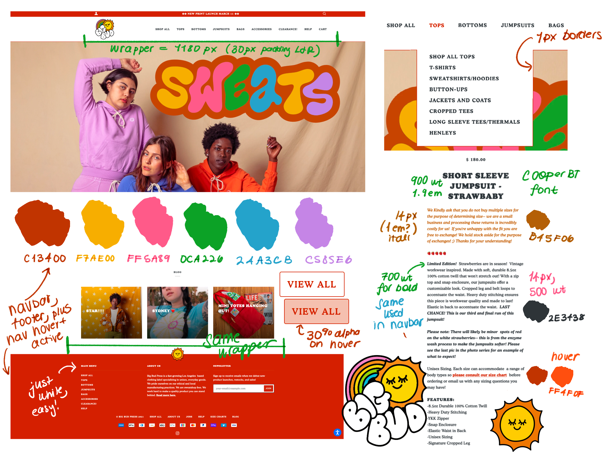
```

(made in procreate, if you're curious)

To summarise a bit:

* The website has a header and footer that span the entire screen, but the actual content (including the website navigation) is limited to 1180 pixels. This is something I see a lot of lately - I'm not sure if it's a ~trend or if I only noticed because I got a wider monitor, but it's *really* apparent (and awful) now when a store's website is full width.
* The header and footer are the same colour (a dark red, `r color_preview("#C13400")`), and this is used throughout the site - it's the colour when you hover over a link in the navigation bar, the colour of the link for the page you're currently on, the colour used to outline buttons, for links in text, and more.
* You might be keen and have looked at Big Bud Press and noticed that everything is turquoise instead of red... I KNOW! They had a launch and updated the site in the middle of me working on this. So while everything in this ~brand assessment~ is red, I'll actually go with the turquoise they're using now, which is `r color_preview("#00807A")`. Moving on...
* The navigation bar is also limited in width to 1180 pixels, with a logo on the left and the navigation links pushed to the right. The navigation links are also centered vertically with the logo.
* The site uses the Cooper BT font, with a 500 weight for regular text, 700 weight for bold, and 900 weight for headings.
* Their logo and branding is super cute.

Now... how do we get a shiny app to look like that?! With CSS and patience. Unfortunately this is not a tutorial on learning CSS - I don't know it well enough to teach it! I'll try to explain along the way, but I really recommend resources like [Mozilla's docs](https://developer.mozilla.org/en-US/docs/Web/CSS). My general strategy is to spend a lot of time in the page inspector and just reload a lot. You don't need to create *all* of the CSS from scratch (the basic Shiny apps use a stylesheet from Bootstrap), just change (and override) the bits that you don't like!

If you don't want to read the whole post (no problem!) and just see the final product, feel free to check out the [app](https://sharlagelfand.shinyapps.io/bigbudpress/), [Shiny code](https://github.com/sharlagelfand/bigbudpress/blob/main/app.R), and [CSS](https://github.com/sharlagelfand/bigbudpress/blob/main/www/style.css)!

I know that there are great packages in development like [bslib](https://rstudio.github.io/bslib/) and [fresh](https://github.com/dreamRs/fresh) to make styling your Shiny app easier without knowing how to use CSS. Right now I know enough CSS to write it myself (never thought I'd say that!) so that's how I'll go!

I'm starting off with an app that looks like this. It uses a basic `navbarPage()` layout, and looks... pretty basic `r emo::ji("woozy_face")`. The content is all pulled from Google Trends via the [gtrendsR](https://CRAN.R-project.org/package=gtrendsR) package, and the page lets you toggle between weekly data for the past year and hourly data for the past 7 days to see relative interest in the search term "Big Bud Press". I won't go into the construction of this basic app too much, but the [code is here](https://github.com/sharlagelfand/bigbudpress/blob/main/app_initial.R) if you want to look around.

```{r, echo = FALSE}
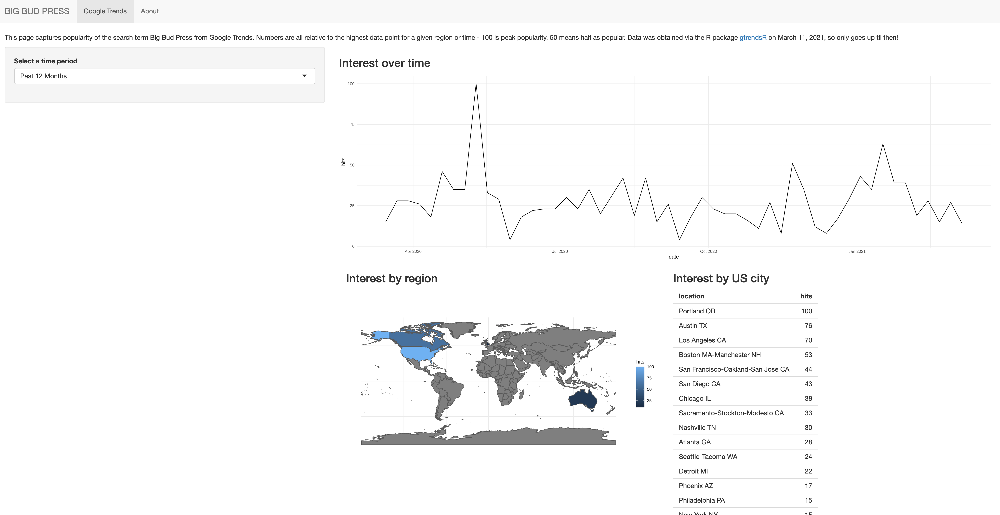
```

The first step is to create a CSS file which will contain all of the rules to style this app. I'll put this in the `www/` directory, with my app file living in the main directory. In order to tell the app to use this CSS file (called `style.css`), I'll link it in the app's UI. This is pseudo code, but the basic idea!

```{r, eval = FALSE}
ui <- tagList(
  tags$head(tags$link(rel = "stylesheet", type = "text/css", href = "style.css")),
  navbarPage(
    title = "BIG BUD PRESS",
    # App UI contents are chilling here!
  )
)
```

There isn't actually anything in the CSS file, so nothing changes with the app!

I'll start off with the font and basic colours. Cooper BT actually isn't a free font, so I can't use it, but I found the [Corben](https://fonts.google.com/specimen/Corben?preview.text_type=custom) font from Google Fonts, which has a similar bubbly 70s vibe. It only comes in two weights - 400 and 700 - and no italics, but good enough for my purposes!

To tell the app to use Corben, first I need to import it into the CSS file:

```{css, eval = FALSE}
/* Import font for use */
@import url('https://fonts.googleapis.com/css2?family=Corben:wght@400;700&display=swap');
```

Next, I'll define some **variables** to use in the file. Like in R, you don't always want to hardcode values like the font, colour, or sizing, because it gets cumbersome to type them out, and in case you need to change 'em later... like if the brand you're ripping off changes their website from red to turqouise in the middle of a blog post. I'll make some variables to store the font I'm using, the base size, weights, as well as some colours.

```{css, eval = FALSE}
:root {
  /* Fonts */
  --text-font-family: "Corben";
  --text-font-base: serif;
  --base-font-size: 18px;
  --base-weight: 400;
  --heavy-weight: 700;

  /* Colours */
  --text-color: #2E3438;
  --background-color: #FFFFFF;
  --primary-color: #00807A;
  --link-color: #00CCC3;
  --white: #FFFFFF;
}
```

Nothing is actually using these variables yet, though! So I'll set everything (`*`, like in SQL) to use the font, size, and text colour I want, referring to variables via something like `var(--variable-name)`. I'll also set the headers to be a heavier weight, and change the colour of links (and their colour on hover):

```{css, eval = FALSE}
/* Set everything to Corben font, with serif as a fallback, and set the colour and size */
* {
  font-family: var(--text-font-family), var(--text-font-base);
  font-size: var(--base-font-size);
  color: var(--text-color);
}

/* Heavier headers */
h1, h2, h3, h4, h5, h6 {
  font-weight: var(--heavy-weight);
}

/* Link colour and hover */
a {
  color: var(--primary-color);
}

a:hover {
  color: var(--link-color);
}
```

Now the fonts are all cute and bubbly, with chunky headers and a colourful link!

```{r, echo = FALSE}
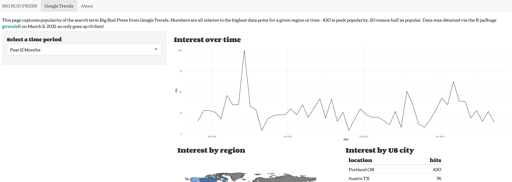
```

Just a general note - if you're just changing the UI of your app, either by editing the actual Shiny code for the UI or the CSS, you *don't* need to stop and restart your app - you can just refresh it to see the changes!

This full width page is really bugging me, so next up I'll update it so that the page is contained to be 1180 pixels wide, centered in the middle of the page.

```{css, eval = FALSE}
/* Limit page content to 1180px */
.container-fluid {
  max-width: 1180px;
  margin-left: auto;
  margin-right: auto;
}
```

```{r, echo = FALSE}
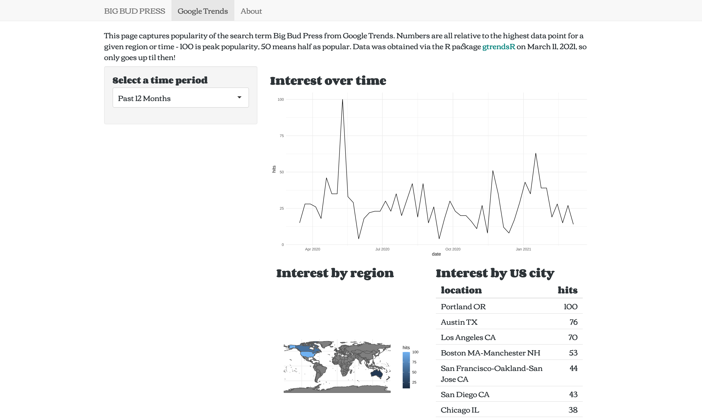
```

That's a little more manageable to look at!

Now I'll tackle the navigation bar. I find this is where I end up focusing most of my energy, but it makes a huge difference. I'll do the fonts first, making them a little chunkier, converting to uppercase (without actually altering the underlying name of the tab in Shiny!), setting the hover/active colour to be that turqouise (our "primary" colour in the app), and removing any additional background on the link of the active page.

I know this CSS can look a bit intimidating, especially the selectors - I hope you take some comfort in knowing that I do NOT know what they all do and YES I just copied 'em from the inspector in Firefox. It works, who cares?

```{css, eval = FALSE}
/* Make nav bar links uppercase and heavier weight */
.navbar-default .navbar-nav > li > a {
  text-transform: uppercase;
  font-weight: var(--heavy-weight);
  color: var(--text-color);
}

/* Change to primary colour on hover, make active tab navbar link primary colour, and add no additional background to all */
.navbar-default .navbar-nav > li > a:hover, .navbar-default .navbar-nav > .active > a, .navbar-default .navbar-nav > .active > a:focus, .navbar-default .navbar-nav > .active > a:hover, .navbar-default .navbar-nav > .open > a:hover {
  color: var(--primary-color);
  background-color: transparent;
}
```

```{r, echo = FALSE}
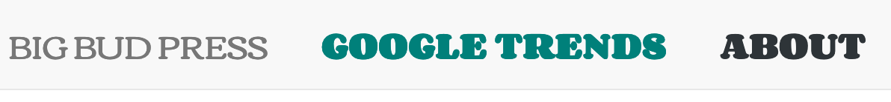
```

So cute! But it would be cuter with their logo, so I'll add that in by altering the underlying Shiny code. I'm making it so that the logo is a link that returns you to first page of the Shiny app, rather than... doing nothing. The logo also lives in the `www/` directory.

In the R code, I load the logo and update the `navbarPage` code to look a little something like this. The `windowTitle` argument refers to what you see as the page's title in your browser (ie on a tab) - otherwise it would be something like `<a href="/" img<...` no thanks!

```{r, eval = FALSE}
logo <- a(href = "/", img(src = "logo.webp", alt = "BIG BUD PRESS", height = "100px"))

navbarPage(
  title = logo,
  windowTitle = "BIG BUD PRESS",
  # App UI contents are chilling here!
)
```

To make the navigation bar fit the logo, I need to update the CSS. I'll also change the navbar to have a white background, with a thin bottom border in our primary colour and a thick top one (to emulate the header on the website), and adjust the height of the navigation bar links so that they're centered with the logo, give a little more space between 'em, and push them to the right:

```{css, eval = FALSE}
/* Account for logo size */
.navbar-brand {
  height: 130px; /* Image is 100px + 15px padding top and bottom */
}

.navbar-default .navbar-nav > li > a {
  line-height: 100px;
  bottom: 0px;
  margin-left: 30px;
}

/* Remove background from navbar, set bottom border and mock header */
.navbar-default {
  background-color: var(--white);
  border-bottom: 1px solid var(--primary-color);
  border-top: 30px solid var(--primary-color);
}

/* Push navbar links to the right */
.navbar-nav {
  float: right;
}
```

```{r, echo = FALSE}
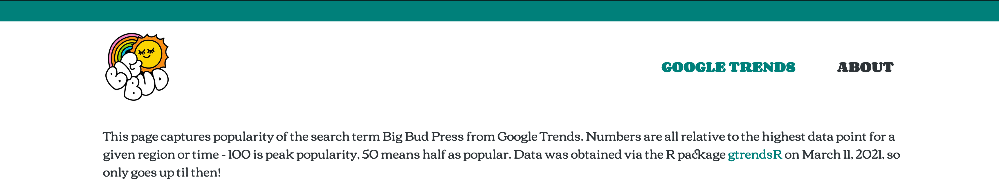
```

Doesn't that make a world of difference?!

I'll also add a footer to mimic theirs, with a little credit to me! Adding the actual footer in Shiny:

```{r, eval = FALSE}
logo <- a(href = "/", img(src = "logo.webp", alt = "BIG BUD PRESS", height = "100px"))

navbarPage(
  title = logo,
  windowTitle = "BIG BUD PRESS",
  footer = footer,
  # App UI contents are chilling here!
)
```

and the styling in the CSS:

```{css, eval = FALSE}
/* Set colour and height, push to bottom, and take up full width (not just contained to the container) */
.bb-footer {
  background-color: var(--primary-color);
  min-height: 30px;
  position: fixed;
  bottom: 0;
  left: 0;
  width: 100%;
}

/* Style footer fonts */
.bb-footer p {
  color: var(--white);
  text-align: center;
  font-weight: 700;
  padding-top: 10px;
}

.bb-footer a {
  color: var(--white);
}

.bb-footer a:hover {
  color: var(--primary-color);
}

/* Add a little padding to the bottom of the page so the footer doesn't cover it */
body {
  margin-bottom: 50px ;
}
```

```{r, echo = FALSE}
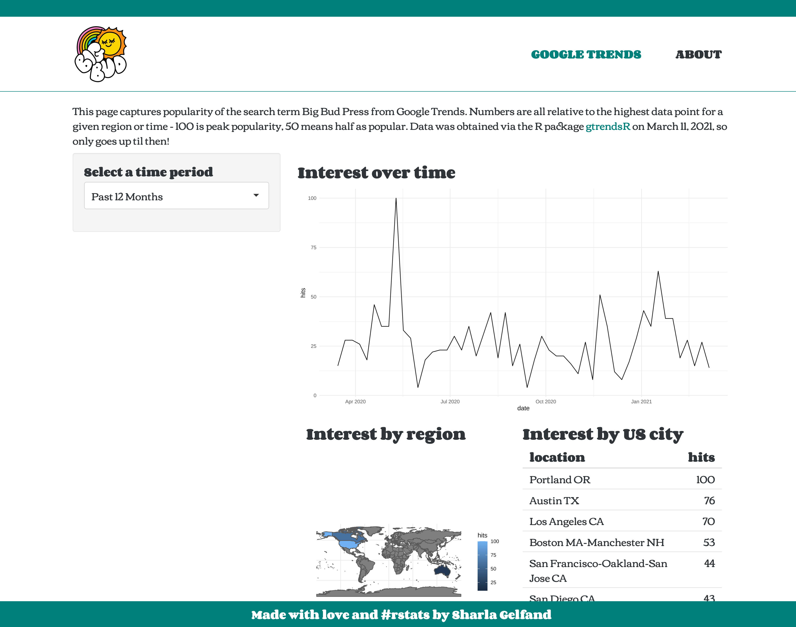
```

Beauty!

That's almost it for CSS, I'll just add a favicon (the little icon you see on a website's tab) in before I tackle the app layout a bit. In Shiny:

```{r, eval = FALSE}
ui <- tagList(
    tags$head(
      tags$link(rel = "stylesheet", type = "text/css", href = "style.css"),
      tags$link(rel = "shortcut icon", href = "favicon.webp")
    ),
    navbarPage(
      # You already know what's up here
    )
  )
```

It's cute, I promise `r emo::ji("sun")`.

Now for the layout! I don't have too many changes to make, I promise, but this sort of sidebar layout isn't very cute here, nor necessary, since there's only one input! Lately I've enjoyed having any inputs go horizontally on top of the outputs, so let's do that, making it sit alongside the text, and move the plots and table into `wellPanel()`s so there's some distinction between them. I won't bore you with the Shiny code (I assume you know how to use `column()` already!), but here's how it looks:

```{r, echo = FALSE}
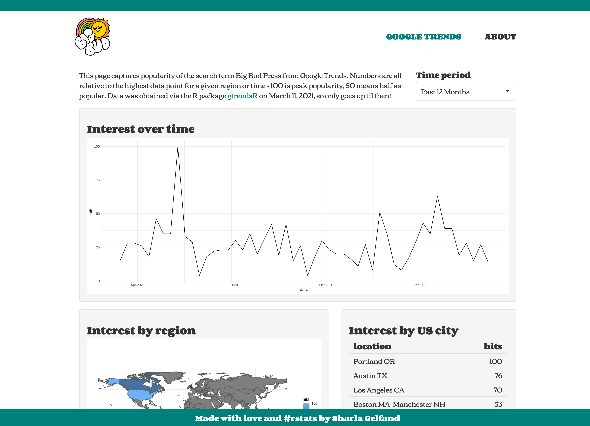
```

That's much sleeker, but those `wellPanel()`s are not it! Let's style them up with a little CSS:

```{css, eval = FALSE}
/* Make the well panels colourful and chunk, remove that background */
.well {
  border-radius: 5px;
  border: 3px solid var(--primary-color);
  background-color: transparent;
}
```

```{r, echo = FALSE}
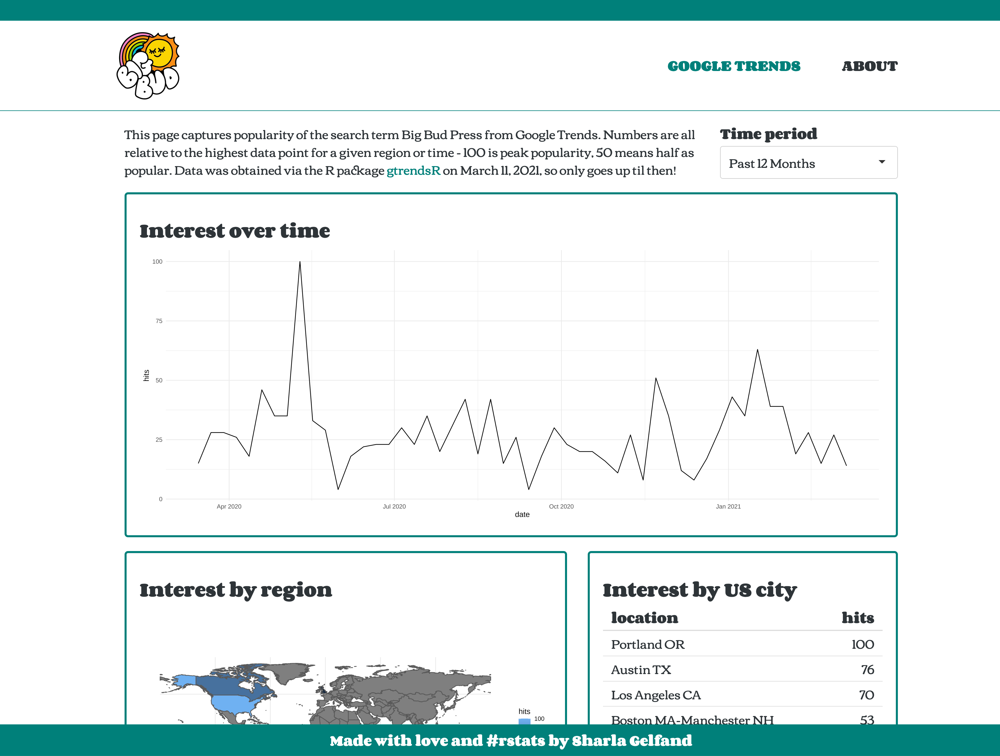
```

And add a cute sun GIF for when the content is loading:

```{r, echo = FALSE}

```

```{r, echo = FALSE}
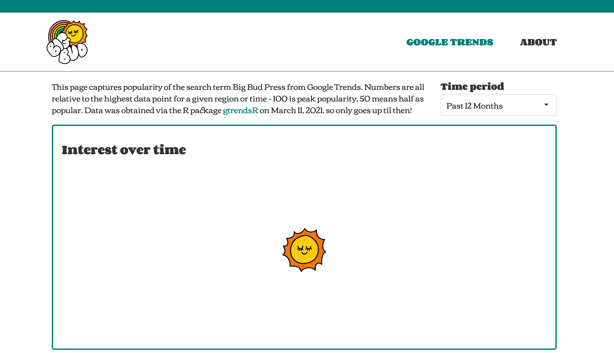
```

And lastly for this page, give the plots and table a little personality. Theming ggplot2 could be (should be?) an entire post on its own, and I won't go into that - but here's how they look!

```{r, echo = FALSE}
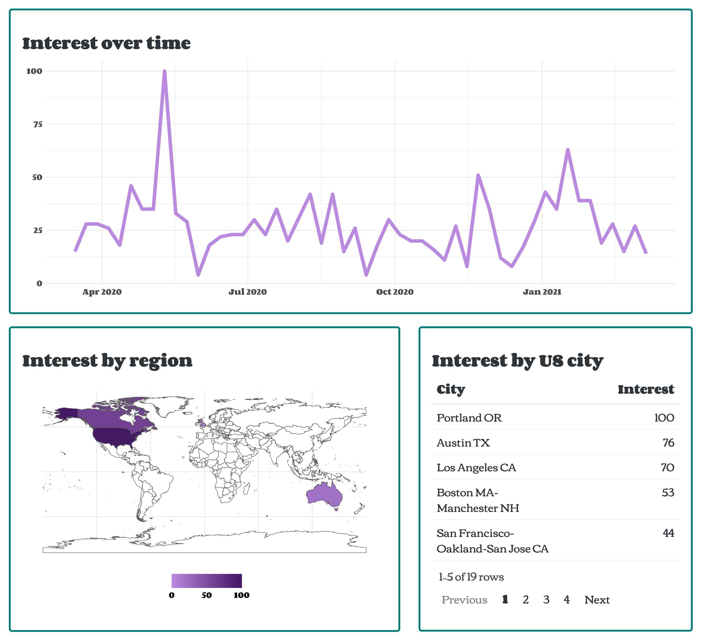
```

Lastly, it's a little jarring to just be landed straight onto a Google Trends page when you go to an app! I'll make the "About" page come first, and give it some personality. You can see all the code that went into this bit [starting here](https://github.com/sharlagelfand/bigbudpress/blob/main/app.R#L32).

```{r, echo = FALSE}
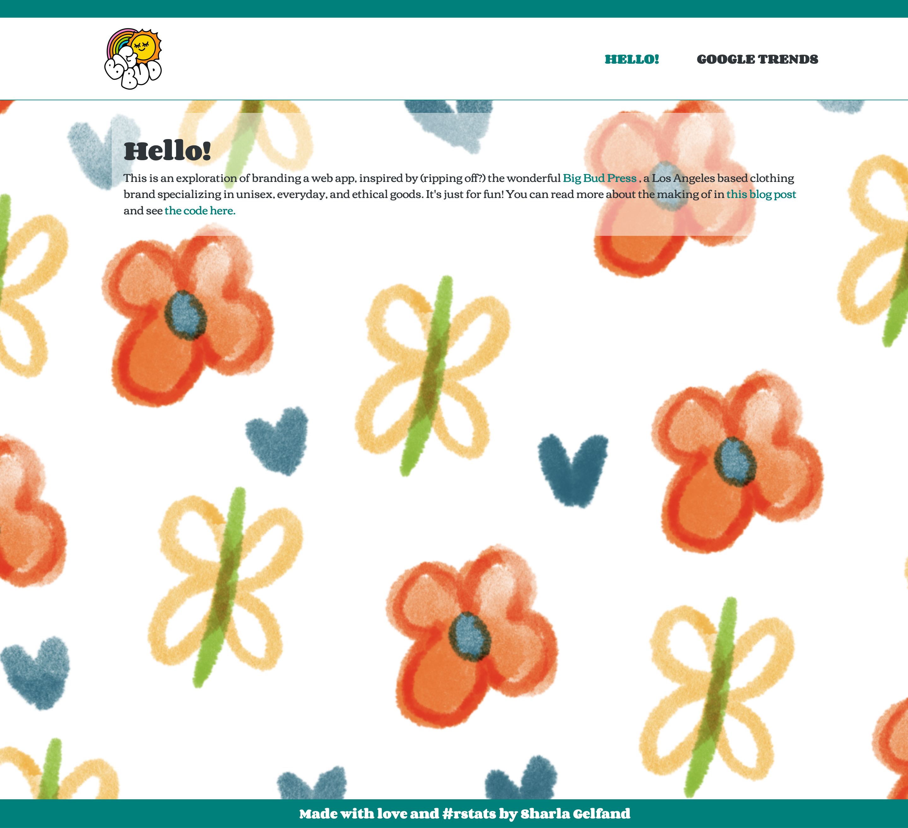
```

And there you have it!! Let's do a before and after of the main page, just to see how far it's come:

```{r, echo = FALSE}

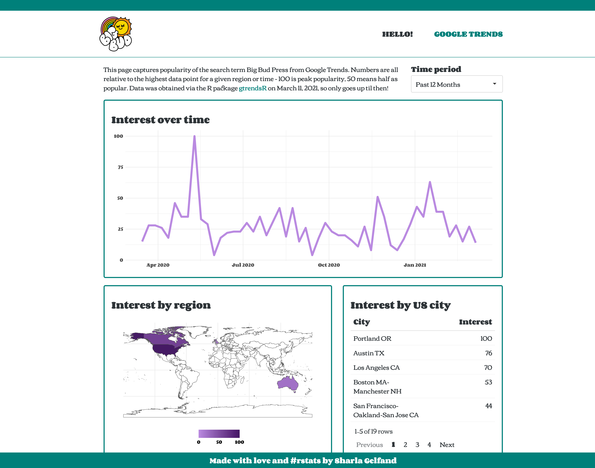
```

And the final links again: [app](https://sharlagelfand.shinyapps.io/bigbudpress/), [Shiny code](https://github.com/sharlagelfand/bigbudpress/blob/main/app.R), and [CSS](https://github.com/sharlagelfand/bigbudpress/blob/main/www/style.css)!

I hope this was helpful for understanding how you can style your Shiny apps to give them more branding and personality. This was not exhaustive, and doesn't cover stuff like optimizing for mobile layouts (looks pretty cute on my iPad though), but I hope it's enough to inspire and get you started!

Bye!
